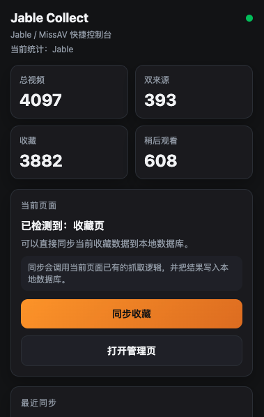
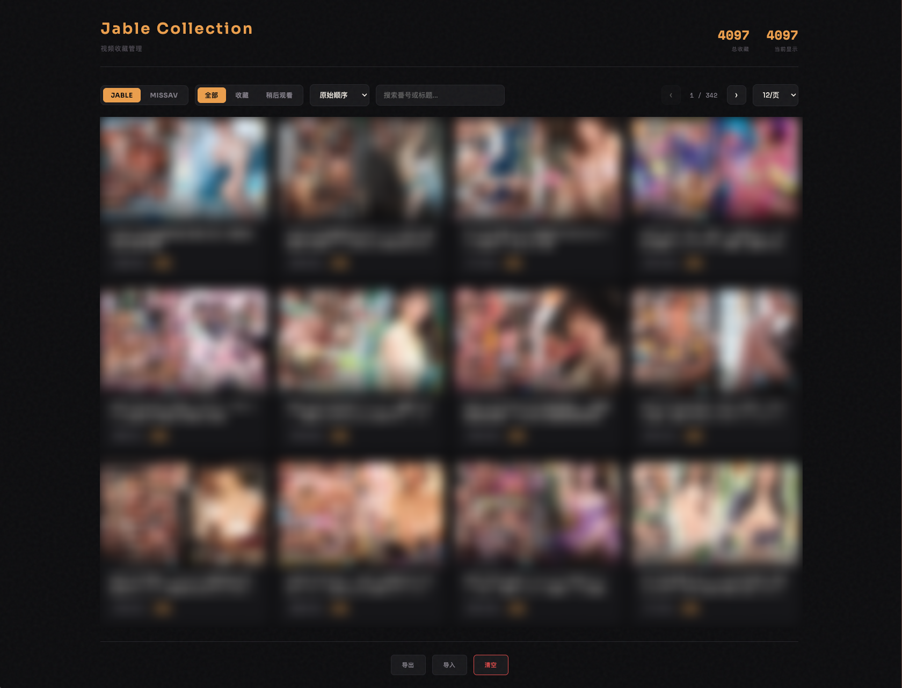

# Jable Collect

English version [*click here*](https://github.com/OrangeSAM/jable-collect/blob/main/readme.md)

**Jable.tv + MissAV 收藏管理 Chrome 插件** — 一键同步、本地存储、强大检索。

> 免费开源，数据全部保存在本地，不上传任何服务器。

---

## 功能特性

- **一键同步收藏** — 自动翻页抓取 Jable.tv 收藏/稍后观看列表，以及 MissAV `/saved` 页面，无需手动操作
- **本地 IndexedDB 存储** — 数据永久保存在浏览器本地，关闭浏览器也不丢失
- **双站点隔离** — Jable 和 MissAV 数据分开管理，互不干扰
- **双来源合并** — 同一视频同时出现在「收藏」和「稍后观看」时自动合并，不重复计数
- **按番号搜索** — 支持按番号（如 `CAWD-958`）或标题关键词快速检索
- **灵活排序** — 原始顺序 / 番号 A→Z / 番号 Z→A
- **来源筛选** — 按「全部 / 收藏 / 稍后观看」分类查看
- **导出 / 导入** — 支持 JSON 格式备份和恢复数据
- **弹窗快捷面板** — 点击插件图标即可查看统计数据、触发同步

---

## 截图



---

## 安装方法

由于本插件目前未上架 Chrome Web Store，需手动加载：

1. **下载安装包**
   - 点击 [*链接*](https://github.com/OrangeSAM/jable-collect/releases/tag/v1.0.0) **jable-collect-v1.0.0**，解压到本地

2. **加载插件**
   - 打开 Chrome，地址栏输入 `chrome://extensions/`
   - 右上角打开 **「开发者模式」**
   - 点击 **「加载已解压的扩展程序」**
   - 选择解压后的项目文件夹

3. **完成** — 浏览器工具栏出现插件图标即安装成功 ✓

---

## 使用方法

### 同步 Jable.tv 收藏

1. 登录 Jable.tv 账号
2. 访问收藏页：`https://jable.tv/my/favourites/`
3. 点击浏览器右上角插件图标 → **「同步当前页面」**
4. 插件自动翻页抓取全部收藏，完成后弹窗显示同步结果

### 同步 MissAV 收藏

1. 登录 MissAV 账号
2. 访问收藏页：`https://missav.ws/saved`
3. 同上，点击 **「同步当前页面」**

### 管理收藏

- 点击插件图标 → **「打开管理页」**
- 在管理页可以：搜索、排序、按来源筛选、删除、导出/导入数据

---

## 项目结构

```
├── manifest.json        # 插件配置（Manifest V3）
├── background.js        # Service Worker，负责 IndexedDB 读写
├── content.js           # Jable.tv 页面内容脚本
├── content-missav.js    # MissAV 页面内容脚本
├── popup.html / popup.js    # 弹窗快捷面板
└── options.html / options.js  # 收藏管理页
```

---

## 常见问题

**Q: 同步按钮是灰色的，无法点击？**
A: 只有在 Jable 收藏页、稍后观看页或 MissAV `/saved` 页面时才能触发同步，请先跳转到对应页面。

**Q: 数据会上传到服务器吗？**
A: 不会。所有数据仅保存在本地浏览器的 IndexedDB 中。

**Q: 支持 Edge / Firefox 吗？**
A: 基于 Manifest V3 开发，理论上支持 Chromium 系浏览器（Chrome、Edge、Brave 等）。Firefox 暂未测试。

---

## 开源协议

MIT License — 自由使用、修改、分发。

---

## 贡献 & 反馈

欢迎提 Issue 或 PR！如果觉得好用，请给个 ⭐ Star 支持一下。


